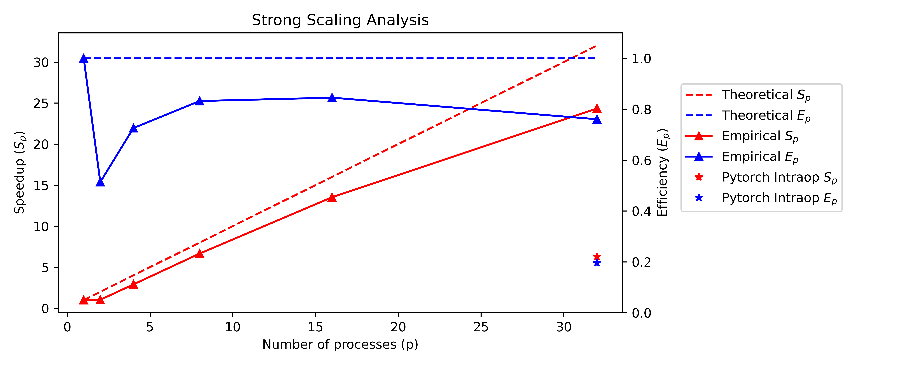

# Fast Adversarial Training for Neural Networks

Neural networks have been shown to be extremely vulnerable to adversarial attacks, often small inperceptible changes to an image or input which completely confuses the model. Luckily, we can defend against these attacks well by producing adversaries at train time, but generating adversaries for a specific set of model weights is extremely expensive, up to $k$ times longer than traditional backpropagation for an adversary of strength $k$. Our goal is to make research in understanding such *robust* networks actually feasible by speeding up training.


This project is on parallelizing the training of robust neural networks by extending the C++ implementation of PyTorch. We significantly optimize the method popularized by Madry et al. (https://arxiv.org/pdf/1706.06083.pdf). **We achieve an efficient 25x speedup using 32 cores**, with higher speedups available with more computing resources! See our report (link here) for our full spiel why we did this and our crazy results!

Note: Our method provides a speedup for any fixed vector-to-vector (where vector sizes are fixed) neural network - resnets, transformers, you name it!



The red lines show our true speedup (Sp) against the theoretical maximum speedup (this theoretical bound ignores communication overhead) as we increase the number of cores and processes (maintaining 1 core per process), and show that we outperform PyTorch's intraop parallelism by more than 4x! Our efficiency is shown in blue.

## Motivation

Training robust models requires exposing the model to adversaries during training. The current state-of-the-art algorithm for training robust models, researched by Madry et al. (https://doi.org/10.48550/arxiv.1706.06083), applies projected gradient descent (PGD) to input images before the model is trained on them. PGD iteratively modifies the input image k times to fool the model, and is a variant of the fast gradient sign method (https://doi.org/10.48550/arxiv.1412.6572).
  
This computation is expensive because it requires performing backpropagation $k$ times, where $k$ is desired to be large since more PGD iterations corresponds to stronger adversaries, which translates to a more robust model. Since the adversary generation is dependent on the specific model weights, adversaries cannot be precomputed for a dataset. Instead, adversaries are computed immediately prior to being used to performing a weight update. Since adversary generation requires k backpropagation steps, and the weight update is also a backpropagation step, adversary generation takes approximately $k$ times as long as the weight update.
  
As we stand today, training large scale machine learning models is already very expensive, and thus training *robust* machine learning models is nearly infeasible due to the $k$ times slowdown. Thus, our goal is to make training robust neural networks more practical for researchers working in HPC environments. We propose and show significant performance improvements of a novel parallel approach to robust model training using MPI and OpenMP. As adversary generation is a very intensive task to add into ML model training, an effective parallel implementation could have major implications for a variety of real-world applications. We hope this research can eventually stem into a library for other researchers.
  
## Approach

We parallelize the weight updates and adversary generation across multiple processes. For a detailed description of our novel method, see our report.


### For Devs: Running the Code on Harvard Clusters or AWS

Our primary code in located in `implementation/example_mnist/mnist/mnist.cpp`. Follow
the steps below to run the code on the FASRC cluster.

```bash
cd implementation
module purge
module load gcc/10.2.0-fasrc01 openmpi/4.1.1-fasrc01 CMake/3.9.1
```

We need to install libtorch. The following is the command to install it for linux machines.

```bash
wget https://download.pytorch.org/libtorch/nightly/cpu/libtorch-shared-with-deps-latest.zip
unzip libtorch-shared-with-deps-latest.zip
cd example_mnist/mnist/build
```

Clear all files in this directory if there are any. Set the environment variable:

```bash
CXX=mpic++
cmake -DCMAKE_PREFIX_PATH=$HOME/team20/implementation/libtorch ..
```

If on AWS M4 cluster, change `CMAKE_CXX_COMPILER` to the following in the 
`cmakecache.txt` file.

``CMAKE_CXX_COMPILER:STRING=/usr/lib64/openmpi/bin/mpic++``

Now we are ready to make!

```bash
make
```

Usage: `./mnist epochs advsteps step_size verbose kCheckReceiveInterval`

```bash
srun -n1 -c1 ./mnist 1 1 1.0 1 1
```

This will run the sequential code on a single process! To run in parallel
(use `mpirun` if on AWS):

```bash
srun -n4 -c1 ./mnist 1 3 1.0 1 1
```

This will run with 4 processes (1 core per process), and 3 adv steps per process. It is optimal
to run with n-1 adv steps if we are running with n processes.

## Reproducing Performance Benchmarks

The bash scripts we used to run the strong and weak scaling analysis 
are located in `implementation/example_mnist/mnist/aws.sh`. These were updated
after our presentation to force each process to use a single core, so the 
sequential implementation uses a single core. In our report, we still show we 
provide a significant speedup to sequential code that uses PyTorch intra-op
parallelism (see commented out script in `aws.sh`) to run on 32 cores 
(without an MPI parallelism), although this is not our primary comparison point.

If on an M4 AWS instance, you can run:

```bash
bash -x aws.sh
```

once the setup above has been completed (downloading libtorch, running cmake),
to reproduce our strong and weak scaling results. We are working on creating the 
equivalent SLURM scripts that can be issued for the Harvard FASRC cluster. It is 
challenging because the cluster has been down frequently lately. Our own results are
available at `team20/implementation/example_mnist/mnist/results`!

Update: SLURM script provided below in `implementation/example_mnist/mnist` directory. 
This submits multiple sbatch jobs to broadwell nodes. Full experimentation to generate
results are available in `aws.sh` (does not work on cluster directly) and can be adapted 
to SLURM quite easily.
```bash
sbatch run_batch_parallel.sh
```

* Team supervisor is Fabian: fabianw@seas.harvard.edu
